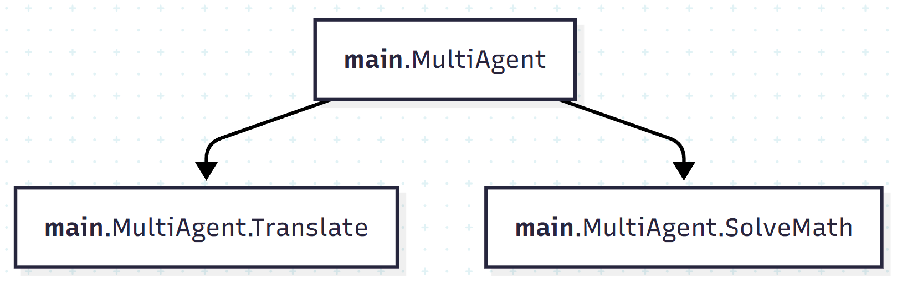
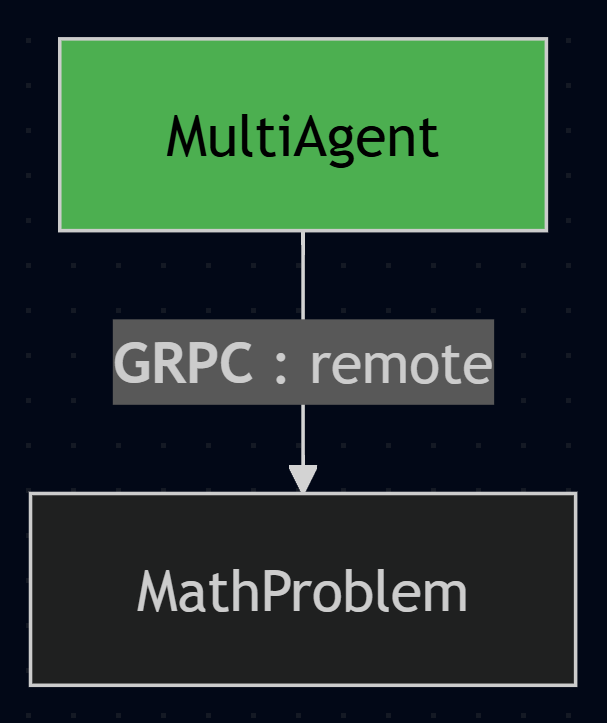

# 🤖 PyBotchi

> _A deterministic, intent-based AI agent orchestrator with no restrictions—supports any framework and prioritizes human-reasoning approach._

[](https://www.python.org/downloads/)
[](LICENSE)

---

## 🎯 Core Philosophy

**Humans should handle the reasoning. AI should detect intent and translate natural language into processable data.**

Traditional development has successfully solved complex problems across every industry using deterministic code, APIs, and events. The real limitation isn't in execution—it's in **translation**. What if we could accept natural language and automatically route to the right logic?

PyBotchi takes a different approach from most AI frameworks: **LLMs excel at understanding intent and translating between human and computer language—not at business logic, calculations, or deterministic execution.** Let each do what it does best.

### The PyBotchi Workflow

1. **Detect & Translate** (LLM Layer) - Process natural language to extract intents and identify appropriate Actions with arguments
2. **Execute Logic** (Your Code) - Traditional code handles business logic, calculations, and data processing
3. **Generate Response** (LLM Layer) - Transform processed results back into natural language

---

## ⚡ Core Architecture

**Nested Intent-Based Supervisor Agent Architecture** built on just **3 core classes**:

- **`Action`** - The central agent with a defined lifecycle for intent and execution logic
- **`Context`** - Universal container for conversational state, metadata, and execution context
- **`LLM`** - Singleton client for managing your model connection

This minimal foundation ensures extreme speed, efficiency, and maximum customizability.

---

## 🌟 Key Features

### 🪶 **Ultra-Lightweight**
Only 3 core classes to master. The entire system is built on a minimal foundation that minimizes overhead while maximizing performance.

### 🏗️ **Object-Oriented Design**
Built on Pydantic `BaseModel` for rigorous data validation and industry-standard type hinting. Every component is inherently overridable and extendable.

### 🔧 **JSON Schema Native**
Automatic JSON Schema conformance for OpenAI, Gemini, and other LLM providers. Easily adaptable to any provider's specification.

### 🎣 **Action Lifecycle Hooks**
Fine-grained control over execution stages with overridable hooks: `pre`, `post`, `on_error`, `fallback`, `child_selection`, and `commit_context`.

### ⚡ **Highly Scalable**
Async-first architecture with built-in support for distributed execution via gRPC. Deploy agents remotely or across machines for massive parallel workloads.

### 🧱 **Truly Modular**
Agents are isolated, self-contained units. Different teams can independently develop, improve, or modify specific agents without impacting core logic.

### 🔗 **Graph By Design**
Structured parent-child relationships provide clear visibility into system execution and state, simplifying debugging and testing.

### 🌍 **Framework & Model Agnostic**
Works with any LLM client, third-party framework, or business requirement. True agnosticism through complete overridability.

### 🔌 **MCP Protocol Support**
Full integration with Model Context Protocol—expose your Actions as MCP tools or consume external MCP servers within your workflows.

---

## 🚀 Quick Start

### Installation

PyBotchi requires Python 3.12 or higher.

```bash
pip install pybotchi

# With gRPC support for distributed execution
pip install pybotchi[grpc]

# With MCP support for Model Context Protocol
pip install pybotchi[mcp]

# With both
pip install pybotchi[grpc,mcp]
```

### Setup LLM

```python
from langchain_openai import ChatOpenAI
from pybotchi import LLM

LLM.add(base=ChatOpenAI(
    api_key="your-api-key",
    model="gpt-4",
    temperature=0.7,
))
```

### Simple Agent

```python
from pybotchi import Action, ActionReturn

class Translation(Action):
    """Translate to specified language."""

    async def pre(self, context):
        message = await context.llm.ainvoke(context.prompts)
        await context.add_response(self, message.text)
        return ActionReturn.GO
```

### Agent with Fields

```python
from pybotchi import Action, ActionReturn

from pydantic import Field

class MathProblem(Action):
    """Solve math problems."""

    answer: str = Field(description="The answer to the math problem")

    async def pre(self, context):
        await context.add_response(self, self.answer)
        return ActionReturn.GO
```

### Multi-Agent Declaration

```python
from pybotchi import Action

class MultiAgent(Action):
    """AI Assistant for solving math problems and translation."""

    class SolveMath(MathProblem):
        pass

    class Translate(Translation):
        pass
```

### Execution

```python
import asyncio

from pybotchi import Context

async def test():
    context = Context(
        prompts=[
            {"role": "system", "content": "You're an AI that can solve math problems and translate requests."},
            {"role": "user", "content": "4 x 4 and explain in Filipino"}
        ],
    )
    await context.start(MultiAgent)
    print(context.prompts[-1]["content"])

asyncio.run(test())
```

**Result:**
```
Ang sagot sa 4 x 4 ay 16.

Paliwanag: Kapag sinabi nating 4 x 4, ibig sabihin ay apat na grupo ng apat. Kung bibilangin natin ito, makakakuha tayo ng kabuuang labing-anim (16).

Ibig sabihin, 4 + 4 + 4 + 4 = 16.
```

### Visualize Your Graph

```python
import asyncio

from pybotchi import graph

async def print_mermaid_graph():
    multi_agent_graph = await graph(MultiAgent)
    print(multi_agent_graph.flowchart())

run(print_mermaid_graph())
```
**Result:**
```
flowchart TD
__main__.MultiAgent.SolveMath[SolveMath]
__main__.MultiAgent{MultiAgent}
__main__.MultiAgent.Translate[Translate]
__main__.MultiAgent --> __main__.MultiAgent.SolveMath
__main__.MultiAgent --> __main__.MultiAgent.Translate
style __main__.MultiAgent fill:#4CAF50,color:#000000
```



---

## 🧩 Action Lifecycle

Every Action follows a structured lifecycle that gives you complete control over execution flow:


### Core Lifecycle Hooks

#### **`pre`** - Pre-Execution
Executes before child agents run. Use for:
- Guardrails and validation
- Data gathering (RAG, knowledge graphs)
- Business logic and preprocessing
- Tool execution

#### **`child_selection`** - Agent Selection
Determines which child agents to execute. Override with:
- Traditional control flow (if/else, switch/case)
- Custom LLM routing logic
- Dynamic agent selection

#### **`post`** - Post-Processing
Executes after all child agents complete. Use for:
- Result consolidation
- Data persistence
- Cleanup and recording
- Logging and notifications

#### **`on_error`** - Error Handling
Handle errors during execution with:
- Retry mechanisms
- Custom error handling
- Logging and alerts
- Re-raise for parent handling

#### **`fallback`** - Non-Tool Results
Executes when no child agent is selected:
- Process text content results
- Handle non-tool-call responses
- Default behaviors

#### **`commit_context`** - Context Control
Controls context merging with main execution:
- Selective data propagation
- Isolated execution contexts
- Custom synchronization rules

### Extended Lifecycle Hooks

- **`pre_mcp`** - MCP connection setup (authentication, config)
- **`pre_grpc`** - gRPC connection setup (credentials, metadata)

---

## 🎨 Everything is Overridable & Extendable

```python
class CustomAgent(MultiAgent):
    SolveMath = None  # Remove action

    class NewAction(Action):  # Add new action
        pass

    class Translate(Translation):  # Override existing
        async def pre(self, context):
            # Custom translation logic
            pass
```

---

## 🔄 Execution Patterns

### Sequential Execution
Multiple agents execute in order via iteration or multi-tool calls.

### Concurrent Execution
Parallel execution using async patterns or threading:

```python
class ParallelAgent(Action):
    __concurrent__ = True  # Enable concurrent execution

    class Task1(Action):
        pass

    class Task2(Action):
        pass
```

### Nested Architectures
Build complex hierarchical structures:

```python
class ComplexAgent(Action):
    class StoryTelling(Action):
        class HorrorStory(Action):
            pass
        class ComedyStory(Action):
            pass

    class JokeTelling(Action):
        pass
```

---

## 🌐 Distributed Systems with gRPC

Scale your agents across multiple servers with real-time context synchronization:

**server.py**
```python
from pybotchi import Action, ActionReturn

from pydantic import Field

class MathProblem(Action):
    """Solve math problems."""

    __groups__ = {"grpc": {"group-1"}}

    answer: str = Field(description="The answer to the math problem")

    async def pre(self, context):
        await context.add_response(self, self.answer)
        return ActionReturn.GO
```
**client.py**
```python
from asyncio import run

from pybotchi import ActionReturn
from pybotchi.grpc import GRPCAction, GRPCConnection, graph


class MultiAgent(GRPCAction):
    __grpc_connections__ = [GRPCConnection("remote", "localhost:50051", ["group-1"])]

    async def pre_grpc(self, context):
        # Setup authentication, refresh tokens, etc.
        return ActionReturn.GO


async def print_mermaid_graph():
    multi_agent_graph = await graph(MultiAgent, integrations={"remote": {}})
    print(multi_agent_graph.flowchart())


run(print_mermaid_graph())
```

### Key Benefits
- **Unified Graph Execution** - Remote Actions integrate seamlessly
- **Zero-Overhead Synchronization** - No polling loops or coordination overhead
- **Database-Free Architecture** - Context syncs directly through gRPC
- **Concurrent Remote Execution** - True distributed parallel processing
- **Resource Isolation** - Separate compute resources per Action group

Start gRPC server:
```bash
pybotchi-grpc server.py
```
**Result**
```bash
#-------------------------------------------------------#
# Agent ID: agent_b6c9ada82c7444818356a6338e975c09
# Agent Path: server.py
# Agent Path: server.py
# Starting None worker(s) on 0.0.0.0:50051
#-------------------------------------------------------#
# Agent Path: server.py
# Agent Handler: PyBotchiGRPC
# gRPC server running on 0.0.0.0:50051
#-------------------------------------------------------#
```
gRPC client print graph:
```bash
python3 client.py
```
```bash
flowchart TD
__main__.MultiAgent[MultiAgent]
grpc.agent_b6c9ada82c7444818356a6338e975c09.MathProblem[MathProblem]
__main__.MultiAgent --**GRPC** : remote--> grpc.agent_b6c9ada82c7444818356a6338e975c09.MathProblem
style __main__.MultiAgent fill:#4CAF50,color:#000000
```

---

## 🔌 Model Context Protocol (MCP)

Integrate with the MCP ecosystem—expose Actions as MCP tools or consume external MCP servers:

### As MCP Server
```python
from pybotchi.mcp import build_mcp_app

class MyAction(Action):
    __groups__ = {"mcp": {"group-1"}}
    # Your action implementation

app = build_mcp_app(transport="streamable-http")
```

### As MCP Client
```python
from pybotchi.mcp import MCPAction, MCPConnection

class Agent(MCPAction):
    __mcp_connections__ = [
        MCPConnection("jira", "SSE", "https://mcp.atlassian.com/v1/sse")
    ]
```

### Key Benefits
- **Standard Protocol Support** - Full MCP specification compatibility
- **Group-Based Organization** - Fine-grained access control per endpoint
- **Bidirectional Integration** - Serve or consume MCP tools
- **Transport Flexibility** - SSE and Streamable HTTP support

---

## 📚 Examples & Use Cases

Explore practical examples demonstrating PyBotchi's capabilities:

### 🚀 Getting Started
- [`tiny.py`](examples/tiny.py) - Minimal implementation
- [`full_spec.py`](examples/full_spec.py) - Complete feature demonstration

### 🔄 Flow Control
- [`sequential.py`](examples/sequential.py) - Sequential action execution
- [`nested_combination.py`](examples/nested_combination.py) - Complex nested structures

### ⚡ Concurrency
- [`concurrent_combination.py`](examples/concurrent_combination.py) - Async parallel execution
- [`concurrent_threading_combination.py`](examples/concurrent_threading_combination.py) - Multi-threaded processing

### 🌐 Distributed Systems
- [`grpc/grpc_pybotchi_agent.py`](examples/grpc/grpc_pybotchi_agent.py) - gRPC server setup
- [`grpc/grpc_pybotchi_client.py`](examples/grpc/grpc_pybotchi_client.py) - Distributed orchestration

### 🔌 MCP Integration
- [`mcp/mcp_pybotchi_agent.py`](examples/mcp/mcp_pybotchi_agent.py) - MCP server implementation
- [`mcp/mcp_pybotchi_client.py`](examples/mcp/mcp_pybotchi_client.py) - MCP client integration
- [`mcp/mcp_pybotchi_client_for_mcp_atlassian.py`](examples/mcp/mcp_pybotchi_client_for_mcp_atlassian.py) - Atlassian MCP integration

### 💼 Real-World Applications
- [`interactive_action.py`](examples/interactive_action.py) - Real-time WebSocket communication

### ⚔️ Framework Comparison
- [`vs/pybotchi_approach.py`](examples/vs/pybotchi_approach.py) - PyBotchi implementation
- [`vs/langgraph_approach.py`](examples/vs/langgraph_approach.py) - LangGraph comparison

---

## 🚀 Why Choose PyBotchi?

**Maximum flexibility, zero lock-in.** Build agents that combine human intelligence with AI precision.

Perfect for teams that need:
- ✅ Modular, maintainable agent architectures
- ✅ Framework flexibility and migration capabilities
- ✅ Community-driven agent development
- ✅ Enterprise-grade customization and control
- ✅ Real-time interactive agent communication
- ✅ Distributed execution without complexity
- ✅ Standard protocol integration (MCP)

---

## 📖 Documentation

Visit our [full documentation](https://amadolid.github.io/pybotchi) for:
- Detailed lifecycle hook explanations
- Advanced patterns and best practices
- gRPC and MCP integration guides
- Complete API reference

---

## 🤝 Contributing

We welcome contributions! Whether it's:
- Bug reports and feature requests
- Documentation improvements
- Code contributions
- Example applications

Check out our [contributing guidelines](CONTRIBUTING.md) to get started.

---

## 📄 License

PyBotchi is released under the MIT License. See [LICENSE](LICENSE) for details.

---

## 🌟 Community

- **GitHub**: [amadolid/pybotchi](https://github.com/amadolid/pybotchi)
- **Issues**: [Report bugs or request features](https://github.com/amadolid/pybotchi/issues)
- **Discussions**: [Join the conversation](https://github.com/amadolid/pybotchi/discussions)

---

**Ready to build smarter agents?** Start with the examples and join the community building the future of human-AI collaboration.
