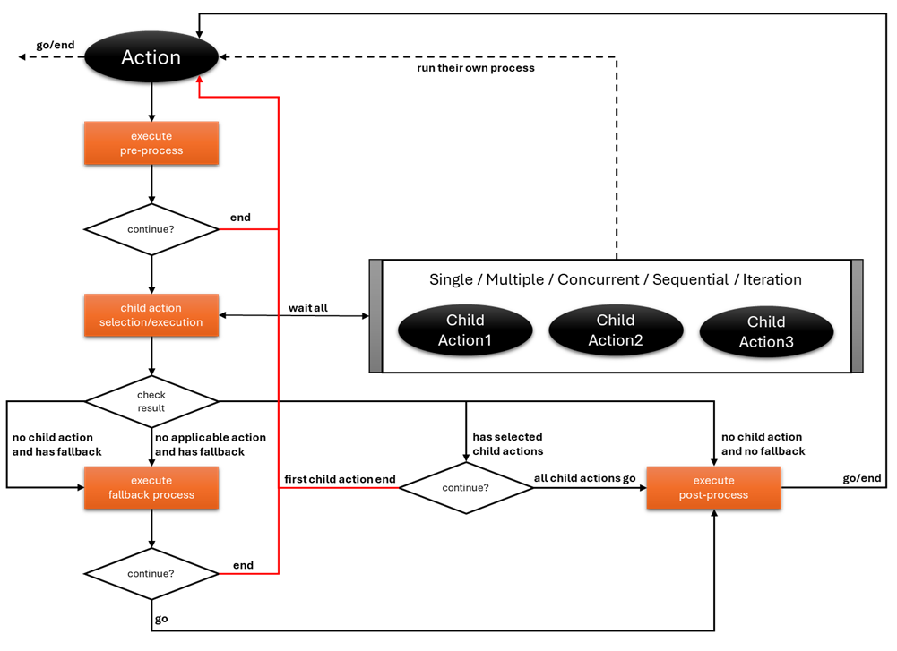

# 🤖 Pybotchi

> _A deterministic, intent-based AI agent builder with no restrictions—supports any framework and prioritizes human-reasoning approach and interactive real-time client communication._

---

## 🎯 Why This Library Exists

The AI agent landscape is rich with powerful frameworks—**LangGraph**, **CrewAI**, and countless others. Each brings unique strengths and trade-offs. **This library aims to support them all, but with a fundamental twist.**

### 🧠 The Problem with Current LLMs

Current LLMs face a **critical limitation**: **reasoning and thinking capabilities remain constrained**, even when enhanced with iterative workflows. Emerging research reinforces this reality—LLMs don't truly possess reasoning power in the way we might expect.

But here's what they _excel_ at: **intent detection and translation**.

Since modern LLMs are extensively trained on natural language, we can leverage this core strength rather than fighting their limitations.

### 💡 Our Philosophy

> **Humans should handle the reasoning. AI should detect intent and translate natural language into processable data.**

This approach unlocks AI's true potential through **tool call chaining**—where AI becomes the perfect interpreter between human intent and computational action.

---

## 🚀 The Vision

_Building agents that combine human intelligence with AI precision._

### ⚡ Lightweight by Design

Pybotchi stays minimal with only **3 core classes**:

- **`Action`** - Describes the intent
- **`Context`** - Holds everything
- **`LLM`** - LLM client instance holder

### 🔧 Everything is Overridable & Extendable

**Maximum flexibility, zero lock-in.** Everything is designed to be overridable and extendable to foster a community where developers can publish their own Actions associated with specific Intents—enabling everyone to reuse or override them for their unique use cases.

Currently, the default tool call invocation uses **LangChain's BaseChatModel**. But you're not stuck with it—override this function and use native SDKs like **OpenAI** directly.

---

## 🚀 Let's Start with the Basics

### **🎯 Prerequisite**

First, you need to import the LLM Class and set the base LLM to be used in Children Selection. You can use alternative frameworks other than LangChain, but you'll also need to override the child selection flow. **We'll discuss that later.**

<details>
  <summary>⚙️ Add base LLM</summary>

```python
from os import getenv
from langchain_openai import AzureChatOpenAI
from pybotchi import LLM

LLM.add(
    base=AzureChatOpenAI(
        api_key=getenv("CHAT_KEY"),  # type: ignore[arg-type]
        azure_endpoint=getenv("CHAT_ENDPOINT"),
        azure_deployment=getenv("CHAT_DEPLOYMENT"),
        model=getenv("CHAT_MODEL"),
        api_version=getenv("CHAT_VERSION"),
        temperature=int(getenv("CHAT_TEMPERATURE", "1")),
        stream_usage=True,
    )
)
```

</details>

### **🧮 Action 1: Mathematical Problem Solver**

This action handles mathematical problem-solving intents. It takes a mathematical problem, processes it, and returns the solution directly through the pre-process phase:

<details>
  <summary>🔢 Add MathProblem Action</summary>

```python
from pybotchi import Action, ActionReturn, Context

class MathProblem(Action):
    """Solve mathematical problem."""

    answer: str = Field(description="You answer to the math problem")

    async def pre(self, context: Context) -> ActionReturn:
        """Execute pre process."""
        await context.add_response(self, self.answer)
        return ActionReturn.END
```

</details>

### **🌍 Action 2: Translation Service**

This action handles translation intents. It leverages the LLM to translate content and properly tracks usage metrics:

<details>
  <summary>🔄 Add Translation Action</summary>

```python
from pybotchi import Action, ActionReturn, Context

class Translation(Action):
    """Translate to specified language."""

    async def pre(self, context: Context) -> ActionReturn:
        """Execute pre process."""
        message = await context.llm.ainvoke(context.prompts)
        context.add_usage(self, context.llm, message.usage_metadata)
        await context.add_response(self, message.content)
        return ActionReturn.GO
```

</details>

**This could already work on its own, but it's only one intent which is the translation.**

### **🔀 Creating a Multi-Intent Agent**

Now we'll merge these into a single Agent that can handle multiple intents:

<details>
  <summary>🤖 Build Agent</summary>

```python
from pybotchi import Action, ActionReturn, Context

# import Translation
# import MathProblem as _MathProblem

class Agent(Action):
    """AI Assistant for solving math problem and translation."""

    class MathProblem(_MathProblem):
        """Solve mathematical problem."""
        # Override your docstring here if necessary. Put pass if you want to use the same docstring

    class TranslateRequest(Translation):
        pass
```

</details>

### **🎬 How to Run It**

You need to build your context. This includes chat history, metadata, and additional useful attributes. **We also prioritize async because most AI agents are integrated in services, most commonly web services.** Since most of the time we don't host LLMs, we are bound to call network requests which are **IO Bound**. This is the reason why we prioritize async.

There's a **hard rule** also on this library: **Context should always have the system prompt entry, even if it's empty content.** This is to have a more consistent way of controlling system prompt. Will give example later.

<details>
  <summary>⚡ Run the Agent</summary>

```python
from asyncio import run

from pybotchi import Context,

async def test() -> None:
    """Chat."""
    context = Context(
        prompts=[
            {
                "role": "system", # or pybotchi.ChatRole.SYSTEM
                "content": "You're an AI the can solve math problem and translate any request.",
            },
            {
                "role": "user", # or pybotchi.ChatRole.USER
                "content": "4 x 4 and explain your answer in filipino",
            },
        ],
    )
    action, result = await context.start(GeneralChat)
    print(dumps(context.prompts, indent=4))
    print(dumps(action.serialize(), indent=4))


run(test())
```

</details>

<details>
  <summary><b>✨ Results</b></summary>

```json
[
    {
        "role": "system",
        "content": "You're an AI the can solve math problem and translate any request."
    },
    {
        "role": "user",
        "content": "4 x 4 and explain your answer in filipino"
    },
    {
        "content": "",
        "role": "assistant",
        "tool_calls": [
            {
                "id": "call_d1b652297be94b6f8999dc8b53005872",
                "function": {
                    "name": "MathProblem",
                    "arguments": "{\"answer\":\"4 x 4 = 16\"}"
                },
                "type": "function"
            }
        ]
    },
    {
        "content": "4 x 4 = 16",
        "role": "tool",
        "tool_call_id": "call_d1b652297be94b6f8999dc8b53005872"
    },
    {
        "content": "",
        "role": "assistant",
        "tool_calls": [
            {
                "id": "call_cf5a5621fea7411bae7c702dd84f3236",
                "function": {
                    "name": "Translation",
                    "arguments": "{}"
                },
                "type": "function"
            }
        ]
    },
    {
        "content": "Ang 4 x 4 ay katumbas ng 16.\n\nPaliwanag sa Filipino:\nAng pag-multiply ng 4 sa 4 ay nangangahulugang ipinadadagdag mo ang bilang na 4 ng apat na beses (4 + 4 + 4 + 4), na nagreresulta sa sagot na 16.",
        "role": "tool",
        "tool_call_id": "call_cf5a5621fea7411bae7c702dd84f3236"
    }
]
---
{
    "name": "GeneralChat",
    "args": {},
    "usages": [
        {
            "name": "$tool",
            "model": "gpt-4.1",
            "usage": {
                "input_tokens": 315,
                "output_tokens": 49,
                "total_tokens": 364,
                "input_token_details": {
                    "audio": 0,
                    "cache_read": 0
                },
                "output_token_details": {
                    "audio": 0,
                    "reasoning": 0
                }
            }
        }
    ],
    "actions": [
        {
                "name": "MathProblem",
            "args": {
                "answer": "4 x 4 = 16"
            },
            "usages": [],
            "actions": []
        },
        {
            "name": "Translation",
            "args": {},
            "usages": [
                {
                    "name": null,
                    "model": "gpt-4.1",
                    "usage": {
                        "input_tokens": 117,
                        "output_tokens": 75,
                        "total_tokens": 192,
                        "input_token_details": {
                            "audio": 0,
                            "cache_read": 0
                        },
                        "output_token_details": {
                            "audio": 0,
                            "reasoning": 0
                        }
                    }
                }
            ],
            "actions": []
        }
    ]
}
```

</details>

---

## **🔄 Understanding the Action Life Cycle**



Every **Action** operates through **five core phases**:

1. **Pre-Process** (Preparation)
2. **Children Selection** (Intent Detection)
3. **Children Execution** (Action Processing)
4. **Fallback** (Optional Response Handling)
5. **Post-Process** (Consolidation)

---

### 🎬 1. Pre-Process: Preparation Phase

- **Purpose:**
  Execute any setup required before intent detection or child action processing.

- **Usage:**
  - For simple actions, you can implement only a pre-process phase, making it the sole execution step.
  - Perfect for preparing data or context for nested intent handling.

---

### 🎯 2. Children Selection: Intent Detection

- **Purpose:**
  Determines which child intents or actions to execute next.

- **Customization:**
  - Override the selection logic to implement custom strategies.
  - Can return any child actions you prefer instead of relying solely on the default.

- **Default Behavior:**
  Uses LLM tool call results to decide which children to invoke.

---

### 🚀 3. Children Execution: Action Processing

- **Order:**
  By default, child actions are executed in the order returned by the LLM.

- **Concurrency:**
  Mark children as concurrent (using Thread or Task annotations) to enable parallel execution.

- **Wait Behavior:**
  Normally, the process waits for all children to complete before continuing to post-process. This can be overridden for advanced scenarios.

- **Recursion:**
  Each child action runs through the complete life cycle (all five phases).

---

### 🔧 4. Fallback: Optional Response Handling

- **Purpose:**
  Provides a graceful way to respond when no child action is selected.

- **When to Use:**
  - Ensures conversation flow when requests don't match any child intent.
  - Useful if a string response (not an action) is needed.

- **Tool Choice Behavior:**
  - **Default:** Tool choice is "required" (must select a child action).
  - **With Fallback:** Tool choice is "auto" (allows a text/string response).

- **Flexibility:**
  If no suitable child action is detected, the tool call can return a string message as the response.

---

### 🏁 5. Post-Process: Consolidation Phase

- **Purpose:**
  Handles final cleanup, response merging, and any additional processing after child execution.

- **Typical Use Cases:**
  - Merging or transforming the results from multiple child actions.
  - Generating a single consolidated output.

---

## **Real-World Example**

Suppose you have an AI Agent supporting two main intents:

- **TellingJoke**
- **TellingStory** (with two sub-intents: **HorrorStory**, **ComedyStory**)

**Hierarchy:**
```
YouAIAgent (Action)
├── TellingJoke (Action)
│   └── pre-process: generate joke
├── TellingStory (Action)
│   ├── HorrorStory (Action)
│   │   └── pre-process: generate horror story
│   └── ComedyStory (Action)
│       └── pre-process: generate comedy story
└── post-process: consolidate responses and generate merged story
```

### **Flow Example**
_Request:_ _"Tell me a horror story and add a little joke on it."_

**Process:**
1. **TellingStory** is triggered; **HorrorStory** generates a horror story.
2. **TellingJoke** generates a joke.
3. In **post-process**, both responses are merged to create a final, combined story.

This systematic flow allows for predictable
---

## 🎨 Core Design Principles

### **Intent-Based Architecture**
- **Declarative**: Actions describe what they do, not how they do it
- **Scannable**: Understand agent flow in real-time without complex graphs
- **Hierarchical**: Natural nesting mirrors human thought processes

### **Human-Centered Reasoning**
- **AI for Intent**: Let AI excel at understanding what users want
- **Humans for Logic**: Keep complex reasoning in deterministic code
- **Tool Call Chaining**: Bridge natural language to computational action

### **Maximum Flexibility**
- **Framework Agnostic**: Use any LLM framework or native SDKs
- **Override Everything**: Every component can be customized
- **Zero Lock-in**: Replace any part without affecting the rest

---

## 📚 Examples & Use Cases

Ready to dive deeper? Check out these practical examples:

### 🚀 **Getting Started**
- [`examples/tiny.py`](examples/tiny.py) - Minimal implementation to get you started
- [`examples/full_spec.py`](examples/full_spec.py) - Complete feature demonstration

### 🔄 **Flow Control**
- [`examples/sequential_combination.py`](examples/sequential_combination.py) - Multiple actions in sequence
- [`examples/sequential_iteration.py`](examples/sequential_iteration.py) - Iterative action execution
- [`examples/nested_combination.py`](examples/nested_combination.py) - Complex nested structures

### ⚡ **Concurrency**
- [`examples/concurrent_combination.py`](examples/concurrent_combination.py) - Parallel action execution
- [`examples/concurrent_threading_combination.py`](examples/concurrent_threading_combination.py) - Multi-threaded processing

### 🌐 **Real-World Applications**
- [`examples/interactive_agent.py`](examples/interactive_agent.py) - Real-time WebSocket communication
- [`examples/jira_agent.py`](examples/jira_agent.py) - Integration with MCP Atlassian server
- [`examples/agent_with_mcp.py`](examples/agent_with_mcp.py) - Hosting Actions as MCP tools

---

## 🎯 Key Benefits

- **🪶 Ultra-lightweight**: Only 3 core classes to master
- **🔧 Completely overridable**: Every component can be customized
- **🎯 Intent-focused**: Leverages AI's natural language strengths
- **⚡ Async-first**: Built for real-world web service integration
- **🔄 Deterministic**: Predictable flows make debugging simple
- **🌐 Framework-agnostic**: Works with any LLM framework
- **📊 Built-in tracking**: Automatic usage monitoring and metrics

---

**Ready to build smarter agents?** Start with the examples and join the community of developers building the future of human-AI collaboration.

**📖 More documentation coming soon...**